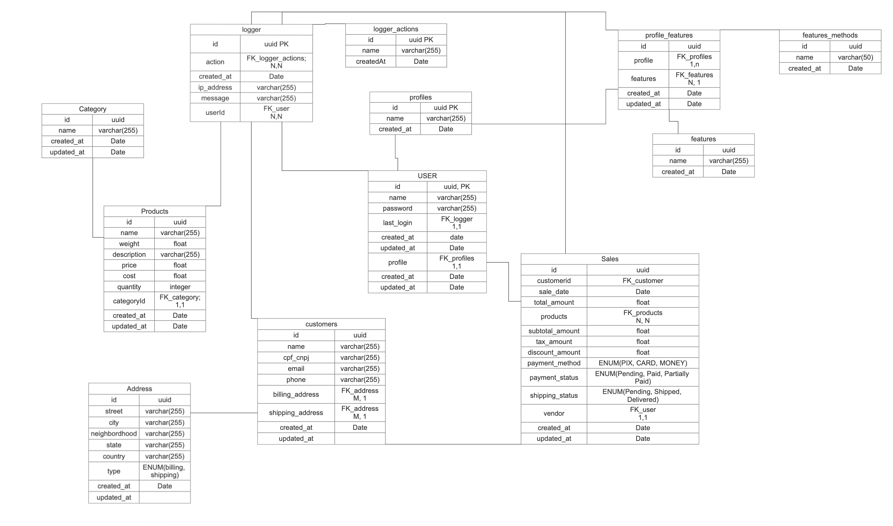

# ERP SYSTEM FOR MANAGEMENT YOUR BUSINESS

This is a university project to create a simple ERP system for managing your business or personal life.
# Technologies

For build this we will use: 

## Backend
- Java: Backend
- OPEN API: Documentation for all our APIs
- SpringBoot: Java framework for building scalable applications 
- PostgresSQL: Database for storing our data

## Frontend
- Javascript: Frontend
- AngularJS: A framework JavaScript, to build web applications

## Both
- Docker: Containerization of our environment
- Git: Version control system for sharing our code
- GitHub: Hosting our code with a version control system

# Database

This is our first data modelling, in future we can update and put below.

# Developers

| User              | GitHub Profile                                                                                                                         | Role      |
|-------------------|----------------------------------------------------------------------------------------------------------------------------------------|-----------|
| Alexandre Zanella |      | Developer |
| Gabriel Seidel    |  | Developer |
| Felippe Butland   |  | Developer |

